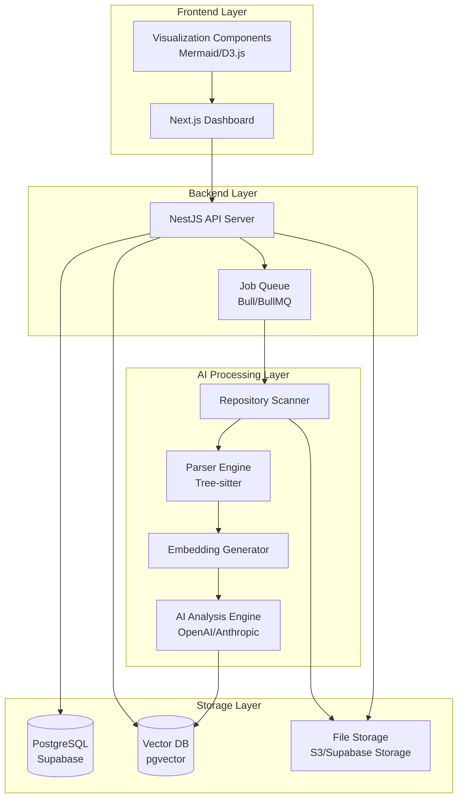
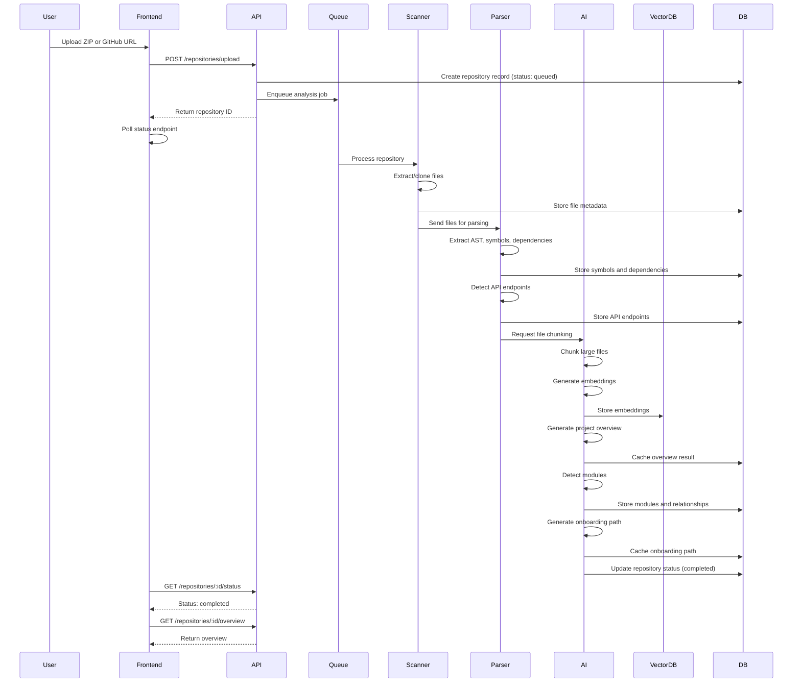
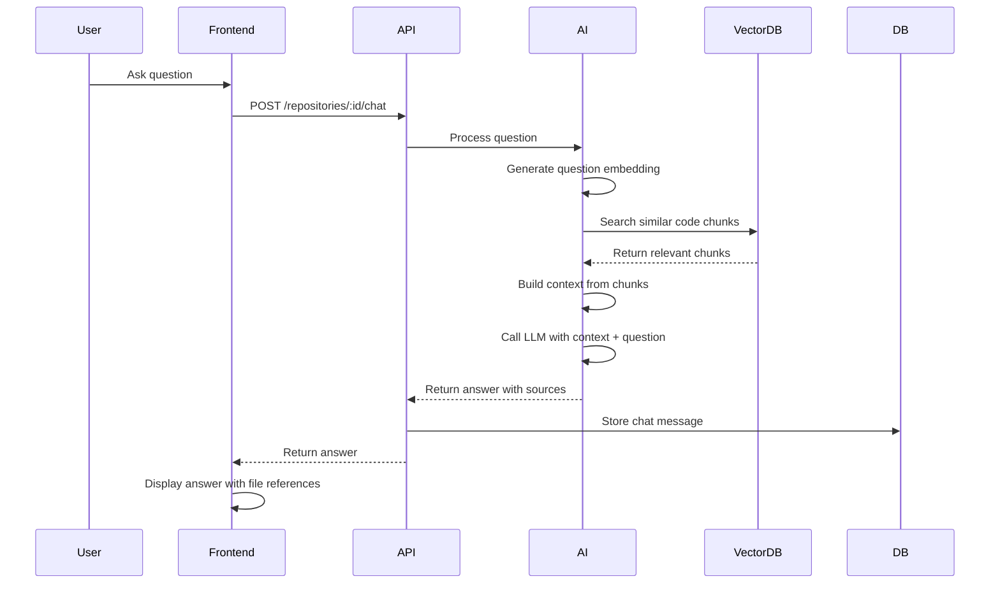

# Design Document: CodeAtlas

## Overview

CodeAtlas is an AI-powered codebase onboarding assistant that transforms repository analysis into an interactive learning experience. The system combines static code analysis, AI-driven insights, and semantic search to help developers understand unfamiliar codebases rapidly.

The architecture follows a layered approach with clear separation between presentation (Next.js frontend), business logic (NestJS backend), AI processing (external APIs + local embeddings), and data persistence (Supabase/PostgreSQL + vector storage). This design enables scalability, maintainability, and future extensibility for CLI and IDE integrations.

### Goals

1. **Rapid Onboarding**: Reduce codebase understanding time from hours to minutes
2. **Intelligent Analysis**: Leverage AI to provide contextual explanations and insights
3. **Interactive Exploration**: Enable developers to navigate and query codebases naturally
4. **Scalable Processing**: Handle repositories of varying sizes efficiently
5. **Extensible Platform**: Support future CLI and IDE extension integrations

## Architecture

### System Architecture Diagram



### Layer Responsibilities

**Frontend Layer**
- Renders interactive dashboard with repository visualizations
- Handles user interactions (file selection, chat queries, navigation)
- Displays architecture maps using Mermaid.js or D3.js
- Manages client-side state and routing

**Backend Layer**
- Exposes REST API for repository operations
- Manages asynchronous job processing for analysis tasks
- Handles authentication and authorization
- Coordinates between AI processing and storage layers

**AI Processing Layer**
- Scans and indexes repository files
- Performs AST extraction using Tree-sitter
- Generates embeddings for semantic search
- Calls external AI APIs for explanations and insights
- Detects API endpoints and module relationships

**Storage Layer**
- Persists repository metadata and analysis results
- Stores vector embeddings for semantic search
- Manages uploaded repository files
- Caches frequently accessed data

## Components and Interfaces

### Repository Scanner

**Responsibility**: Read, validate, and index repository files

**Interface**:
```typescript
interface RepositoryScanner {
  // Scan repository from uploaded ZIP or cloned Git repo
  scanRepository(source: RepositorySource): Promise<ScannedRepository>
  
  // Validate repository size and file types
  validateRepository(files: File[]): ValidationResult
  
  // Extract file metadata (size, type, language)
  extractMetadata(file: File): FileMetadata
}

interface RepositorySource {
  type: 'zip' | 'github'
  location: string // File path or GitHub URL
}

interface ScannedRepository {
  id: string
  files: FileNode[]
  totalSize: number
  languages: string[]
  entryPoints: string[]
}

interface FileNode {
  path: string
  name: string
  type: 'file' | 'directory'
  size: number
  language?: string
  children?: FileNode[]
}
```

**Dependencies**: File system access, Git client, file type detection library

### Parser Engine

**Responsibility**: Extract code structure using AST parsing

**Interface**:
```typescript
interface ParserEngine {
  // Parse file and extract AST
  parseFile(file: File): Promise<ParsedFile>
  
  // Extract imports and dependencies
  extractDependencies(ast: AST): Dependency[]
  
  // Identify functions, classes, and exports
  extractSymbols(ast: AST): Symbol[]
  
  // Detect API endpoints (Express, FastAPI, etc.)
  detectAPIEndpoints(ast: AST): APIEndpoint[]
}

interface ParsedFile {
  path: string
  ast: AST
  symbols: Symbol[]
  dependencies: Dependency[]
  apiEndpoints: APIEndpoint[]
}

interface Symbol {
  name: string
  type: 'function' | 'class' | 'variable' | 'interface'
  startLine: number
  endLine: number
  signature?: string
}

interface Dependency {
  source: string // Importing file
  target: string // Imported module/file
  importType: 'local' | 'external'
}

interface APIEndpoint {
  method: 'GET' | 'POST' | 'PUT' | 'DELETE' | 'PATCH'
  path: string
  handler: string
  file: string
  line: number
}
```

**Dependencies**: Tree-sitter parsers for multiple languages

### AI Analysis Engine

**Responsibility**: Generate explanations and insights using AI models

**Interface**:
```typescript
interface AIAnalysisEngine {
  // Generate project overview summary
  generateProjectOverview(repo: ScannedRepository): Promise<ProjectOverview>
  
  // Generate file-level explanation
  explainFile(file: ParsedFile, context: string[]): Promise<FileExplanation>
  
  // Generate onboarding path
  generateOnboardingPath(repo: AnalyzedRepository): Promise<OnboardingPath>
  
  // Answer natural language questions
  answerQuestion(question: string, repoId: string): Promise<Answer>
  
  // Identify modules and relationships
  detectModules(repo: AnalyzedRepository): Promise<Module[]>
}

interface ProjectOverview {
  summary: string
  primaryLanguage: string
  technologies: string[]
  entryPoints: string[]
  modules: ModuleSummary[]
}

interface FileExplanation {
  filePath: string
  purpose: string
  keyComponents: ComponentExplanation[]
  dependencies: DependencyExplanation[]
}

interface OnboardingPath {
  steps: OnboardingStep[]
  estimatedTime: number
}

interface OnboardingStep {
  order: number
  file: string
  reason: string
  keyPoints: string[]
}

interface Answer {
  response: string
  confidence: number
  sources: SourceReference[]
}

interface SourceReference {
  file: string
  startLine: number
  endLine: number
  relevance: number
}
```

**Dependencies**: OpenAI/Anthropic API client, embedding model, vector search

### Embedding Generator

**Responsibility**: Create vector embeddings for semantic search

**Interface**:
```typescript
interface EmbeddingGenerator {
  // Generate embedding for code chunk
  generateEmbedding(text: string): Promise<number[]>
  
  // Chunk large files for embedding
  chunkFile(file: File, maxChunkSize: number): Chunk[]
  
  // Batch generate embeddings
  generateBatchEmbeddings(texts: string[]): Promise<number[][]>
}

interface Chunk {
  text: string
  startLine: number
  endLine: number
  file: string
}
```

**Dependencies**: OpenAI embeddings API or local embedding model

### Vector Database Interface

**Responsibility**: Store and query embeddings for semantic search

**Interface**:
```typescript
interface VectorDB {
  // Store embedding with metadata
  storeEmbedding(embedding: number[], metadata: EmbeddingMetadata): Promise<string>
  
  // Search for similar embeddings
  searchSimilar(query: number[], limit: number): Promise<SearchResult[]>
  
  // Delete all embeddings for a repository
  deleteRepositoryEmbeddings(repoId: string): Promise<void>
}

interface EmbeddingMetadata {
  repoId: string
  file: string
  startLine: number
  endLine: number
  text: string
}

interface SearchResult {
  id: string
  similarity: number
  metadata: EmbeddingMetadata
}
```

**Dependencies**: pgvector extension for PostgreSQL

### API Endpoints

**Repository Management**

```typescript
// Upload repository
POST /api/repositories/upload
Request: multipart/form-data with ZIP file
Response: { repositoryId: string, status: 'queued' }

// Clone from GitHub
POST /api/repositories/clone
Request: { githubUrl: string }
Response: { repositoryId: string, status: 'queued' }

// Get repository status
GET /api/repositories/:id/status
Response: { 
  status: 'queued' | 'analyzing' | 'completed' | 'failed',
  progress: number,
  error?: string
}

// Delete repository
DELETE /api/repositories/:id
Response: { success: boolean }
```

**Analysis Results**

```typescript
// Get project overview
GET /api/repositories/:id/overview
Response: ProjectOverview

// Get repository structure
GET /api/repositories/:id/structure
Response: FileNode[]

// Get module relationships
GET /api/repositories/:id/modules
Response: Module[]

// Get onboarding path
GET /api/repositories/:id/onboarding
Response: OnboardingPath

// Get file explanation
GET /api/repositories/:id/files/:filePath/explain
Response: FileExplanation

// Get API endpoints
GET /api/repositories/:id/api-endpoints
Response: APIEndpoint[]
```

**Interactive Chat**

```typescript
// Ask question about repository
POST /api/repositories/:id/chat
Request: { question: string, conversationId?: string }
Response: Answer

// Get chat history
GET /api/repositories/:id/chat/:conversationId
Response: { messages: ChatMessage[] }
```

**Documentation Export**

```typescript
// Export documentation
GET /api/repositories/:id/export
Query: { format: 'markdown' | 'json' }
Response: File download or JSON object
```

## Data Models

### Database Schema

```sql
-- Repositories table
CREATE TABLE repositories (
  id UUID PRIMARY KEY DEFAULT gen_random_uuid(),
  user_id UUID NOT NULL REFERENCES users(id),
  name VARCHAR(255) NOT NULL,
  source_type VARCHAR(10) NOT NULL, -- 'zip' or 'github'
  source_location TEXT NOT NULL,
  total_size BIGINT NOT NULL,
  file_count INTEGER NOT NULL,
  primary_language VARCHAR(50),
  status VARCHAR(20) NOT NULL, -- 'queued', 'analyzing', 'completed', 'failed'
  progress INTEGER DEFAULT 0,
  error_message TEXT,
  created_at TIMESTAMP DEFAULT NOW(),
  updated_at TIMESTAMP DEFAULT NOW(),
  deleted_at TIMESTAMP
);

-- Files table
CREATE TABLE files (
  id UUID PRIMARY KEY DEFAULT gen_random_uuid(),
  repository_id UUID NOT NULL REFERENCES repositories(id) ON DELETE CASCADE,
  path TEXT NOT NULL,
  name VARCHAR(255) NOT NULL,
  type VARCHAR(10) NOT NULL, -- 'file' or 'directory'
  size BIGINT,
  language VARCHAR(50),
  parent_id UUID REFERENCES files(id),
  created_at TIMESTAMP DEFAULT NOW()
);

-- Parsed symbols table
CREATE TABLE symbols (
  id UUID PRIMARY KEY DEFAULT gen_random_uuid(),
  file_id UUID NOT NULL REFERENCES files(id) ON DELETE CASCADE,
  name VARCHAR(255) NOT NULL,
  type VARCHAR(50) NOT NULL, -- 'function', 'class', 'variable', 'interface'
  start_line INTEGER NOT NULL,
  end_line INTEGER NOT NULL,
  signature TEXT,
  created_at TIMESTAMP DEFAULT NOW()
);

-- Dependencies table
CREATE TABLE dependencies (
  id UUID PRIMARY KEY DEFAULT gen_random_uuid(),
  repository_id UUID NOT NULL REFERENCES repositories(id) ON DELETE CASCADE,
  source_file_id UUID NOT NULL REFERENCES files(id) ON DELETE CASCADE,
  target_path TEXT NOT NULL,
  import_type VARCHAR(20) NOT NULL, -- 'local' or 'external'
  created_at TIMESTAMP DEFAULT NOW()
);

-- API endpoints table
CREATE TABLE api_endpoints (
  id UUID PRIMARY KEY DEFAULT gen_random_uuid(),
  repository_id UUID NOT NULL REFERENCES repositories(id) ON DELETE CASCADE,
  file_id UUID NOT NULL REFERENCES files(id) ON DELETE CASCADE,
  method VARCHAR(10) NOT NULL,
  path TEXT NOT NULL,
  handler VARCHAR(255) NOT NULL,
  line_number INTEGER NOT NULL,
  created_at TIMESTAMP DEFAULT NOW()
);

-- Modules table
CREATE TABLE modules (
  id UUID PRIMARY KEY DEFAULT gen_random_uuid(),
  repository_id UUID NOT NULL REFERENCES repositories(id) ON DELETE CASCADE,
  name VARCHAR(255) NOT NULL,
  description TEXT,
  directory_path TEXT NOT NULL,
  created_at TIMESTAMP DEFAULT NOW()
);

-- Module relationships table
CREATE TABLE module_relationships (
  id UUID PRIMARY KEY DEFAULT gen_random_uuid(),
  repository_id UUID NOT NULL REFERENCES repositories(id) ON DELETE CASCADE,
  source_module_id UUID NOT NULL REFERENCES modules(id) ON DELETE CASCADE,
  target_module_id UUID NOT NULL REFERENCES modules(id) ON DELETE CASCADE,
  dependency_count INTEGER DEFAULT 1,
  created_at TIMESTAMP DEFAULT NOW()
);

-- Analysis results table (cached AI responses)
CREATE TABLE analysis_results (
  id UUID PRIMARY KEY DEFAULT gen_random_uuid(),
  repository_id UUID NOT NULL REFERENCES repositories(id) ON DELETE CASCADE,
  result_type VARCHAR(50) NOT NULL, -- 'overview', 'file_explanation', 'onboarding_path'
  target_id UUID, -- file_id for file explanations, null for overview
  content JSONB NOT NULL,
  created_at TIMESTAMP DEFAULT NOW()
);

-- Embeddings table (using pgvector)
CREATE TABLE embeddings (
  id UUID PRIMARY KEY DEFAULT gen_random_uuid(),
  repository_id UUID NOT NULL REFERENCES repositories(id) ON DELETE CASCADE,
  file_id UUID NOT NULL REFERENCES files(id) ON DELETE CASCADE,
  start_line INTEGER NOT NULL,
  end_line INTEGER NOT NULL,
  text TEXT NOT NULL,
  embedding vector(1536), -- OpenAI embedding dimension
  created_at TIMESTAMP DEFAULT NOW()
);

-- Create vector similarity search index
CREATE INDEX ON embeddings USING ivfflat (embedding vector_cosine_ops);

-- Chat conversations table
CREATE TABLE chat_conversations (
  id UUID PRIMARY KEY DEFAULT gen_random_uuid(),
  repository_id UUID NOT NULL REFERENCES repositories(id) ON DELETE CASCADE,
  user_id UUID NOT NULL REFERENCES users(id),
  created_at TIMESTAMP DEFAULT NOW()
);

-- Chat messages table
CREATE TABLE chat_messages (
  id UUID PRIMARY KEY DEFAULT gen_random_uuid(),
  conversation_id UUID NOT NULL REFERENCES chat_conversations(id) ON DELETE CASCADE,
  role VARCHAR(20) NOT NULL, -- 'user' or 'assistant'
  content TEXT NOT NULL,
  sources JSONB, -- Array of SourceReference objects
  created_at TIMESTAMP DEFAULT NOW()
);
```

## Data Flow

### Repository Upload and Analysis Flow



### Chat Query Flow



## Error Handling

### Error Categories and Strategies

**Upload Errors**
- Invalid file format → Return 400 with clear message
- File too large → Return 413 with size limit information
- GitHub URL inaccessible → Return 400 with connection error details

**Analysis Errors**
- Unparseable file → Skip file, log warning, continue analysis
- AI API rate limit → Retry with exponential backoff (3 attempts)
- AI API failure → Log error, mark analysis as partially complete
- Embedding generation failure → Skip embedding, continue with other files

**Query Errors**
- No relevant results found → Return empty results with suggestion to rephrase
- Vector search timeout → Return cached results if available, otherwise error
- AI response timeout → Return 504 with retry suggestion

**Data Errors**
- Repository not found → Return 404
- Unauthorized access → Return 403
- Database connection failure → Return 503 with retry-after header

### Error Response Format

```typescript
interface ErrorResponse {
  error: {
    code: string
    message: string
    details?: any
    retryable: boolean
  }
}
```

### Retry Strategy

```typescript
interface RetryConfig {
  maxAttempts: 3
  baseDelay: 1000 // ms
  maxDelay: 10000 // ms
  backoffMultiplier: 2
}

// Exponential backoff: delay = min(baseDelay * (backoffMultiplier ^ attempt), maxDelay)
```

## Testing Strategy

### Dual Testing Approach

CodeAtlas will employ both unit testing and property-based testing to ensure comprehensive coverage:

**Unit Tests**: Validate specific examples, edge cases, and error conditions
- Test specific file parsing scenarios (empty files, syntax errors)
- Test API endpoint detection for known frameworks
- Test error handling paths (rate limits, timeouts)
- Test integration between components

**Property Tests**: Verify universal properties across all inputs
- Test that parsing and serialization maintain consistency
- Test that embeddings are generated for all valid code chunks
- Test that module detection produces valid dependency graphs
- Test that chat responses always include source references when available

Both approaches are complementary and necessary for comprehensive coverage. Unit tests catch concrete bugs in specific scenarios, while property tests verify general correctness across a wide range of inputs.

### Property-Based Testing Configuration

- **Library**: fast-check (TypeScript/JavaScript)
- **Minimum iterations**: 100 runs per property test
- **Tagging format**: Each property test must include a comment:
  ```typescript
  // Feature: code-atlas, Property {number}: {property_text}
  ```

### Test Coverage Goals

- Unit test coverage: 80% of business logic
- Property test coverage: All correctness properties from design
- Integration test coverage: All API endpoints
- End-to-end test coverage: Critical user flows (upload → analyze → query)


## Correctness Properties

A property is a characteristic or behavior that should hold true across all valid executions of a system—essentially, a formal statement about what the system should do. Properties serve as the bridge between human-readable specifications and machine-verifiable correctness guarantees.

### Property 1: ZIP Extraction Consistency

*For any* valid ZIP file containing a repository, extracting the contents should produce a file structure that matches the original archive structure, and re-zipping then extracting should produce an equivalent structure.

**Validates: Requirements 1.1**

### Property 2: Invalid File Rejection

*For any* uploaded file that is not a valid ZIP archive, the system should reject the upload and return an error response with a descriptive message.

**Validates: Requirements 1.4**

### Property 3: Project Overview Completeness

*For any* analyzed repository, the generated project overview should contain all required fields: summary, primary language, technologies list, entry points, and module summaries.

**Validates: Requirements 2.1, 2.2, 2.3**

### Property 4: Repository Structure Tree Validity

*For any* analyzed repository, the generated file tree structure should be a valid tree (no cycles, single root, all files reachable from root) and should contain all files from the original repository.

**Validates: Requirements 3.1, 3.3**

### Property 5: Module Detection Consistency

*For any* analyzed repository, the detected modules should partition the codebase (every file belongs to exactly one module) and module boundaries should align with directory structure or import patterns.

**Validates: Requirements 4.1**

### Property 6: Dependency Graph Validity

*For any* analyzed repository with modules, the dependency graph should be a valid directed graph where each edge corresponds to at least one import statement between files in the source and target modules.

**Validates: Requirements 4.2, 4.5**

### Property 7: Onboarding Path Constraints

*For any* generated onboarding path, the path should contain between 5 and 20 files, each step should include a non-empty reason, and all files in the path should exist in the repository.

**Validates: Requirements 5.1, 5.3, 5.5**

### Property 8: Onboarding Progress Tracking

*For any* onboarding path, marking a file as reviewed should increase the progress count by one, and marking all files as reviewed should result in 100% completion.

**Validates: Requirements 5.4**

### Property 9: File Explanation Completeness

*For any* file in an analyzed repository, the generated explanation should contain all required fields: purpose summary, key components list, and dependencies list with explanations.

**Validates: Requirements 6.1, 6.2, 6.3**

### Property 10: API Endpoint Completeness

*For any* detected API endpoint, the endpoint data should include all required fields: HTTP method, path, handler function name, file location, and line number.

**Validates: Requirements 7.1, 7.2, 7.3**

### Property 11: Chat Answer Source References

*For any* chat question that returns relevant results from vector search, the generated answer should include source references with file paths and line numbers.

**Validates: Requirements 8.1, 8.2**

### Property 12: Documentation Export Completeness

*For any* analyzed repository, the exported documentation should contain all required sections: project overview, architecture map, module descriptions, onboarding path, and API endpoints (if present).

**Validates: Requirements 9.1, 9.2, 9.3**

### Property 13: Large File Chunking

*For any* file exceeding 10,000 lines, the parser should split it into multiple chunks, and the total line coverage of all chunks should equal the original file length.

**Validates: Requirements 10.2**

### Property 14: Query Result Idempotence

*For any* chat question, submitting the same question twice should return equivalent answers (same content and sources), demonstrating proper caching behavior.

**Validates: Requirements 10.3**

### Property 15: Executable File Rejection

*For any* repository upload containing executable files (.exe, .dll, .so, .dylib), the system should reject those files and return an error message listing the rejected file types.

**Validates: Requirements 11.1**

### Property 16: Credential Sanitization

*For any* code file containing patterns matching API keys or credentials (e.g., "API_KEY=", "password="), the system should filter these patterns before transmitting to external AI services.

**Validates: Requirements 11.3**

### Property 17: Repository Deletion Completeness

*For any* deleted repository, all associated database records (files, symbols, dependencies, embeddings, analysis results) should be removed, and querying for the repository should return a not-found error.

**Validates: Requirements 11.4**

### Property 18: Authentication Requirement

*For any* repository access operation (view, analyze, delete, query), the request should fail with an authentication error if no valid authentication token is provided.

**Validates: Requirements 11.5**

### Property 19: Retry with Exponential Backoff

*For any* AI API call that fails, the system should retry up to 3 times with delays following exponential backoff (delay doubles with each retry), and the total number of attempts should not exceed 4 (1 initial + 3 retries).

**Validates: Requirements 12.1**

### Property 20: Graceful Degradation

*For any* batch of files being analyzed, if some files fail to parse or analyze, the system should successfully complete analysis for all valid files and return partial results.

**Validates: Requirements 12.2, 12.4**

### Property 21: Analysis Resumption Consistency

*For any* repository analysis that is interrupted and resumed, the final analysis results should be equivalent to running the analysis without interruption.

**Validates: Requirements 12.3**

### Property 22: Error Response Format

*For any* error condition, the system should return an error response containing a structured error object with code, message, and retryable flag fields.

**Validates: Requirements 12.5**

### Property 23: CLI Output Format Validity

*For any* CLI analysis result, each supported output format (JSON, Markdown, plain text) should be valid according to its format specification and should contain the same semantic information.

**Validates: Requirements 13.2**

### Property 24: CLI Filtering Correctness

*For any* CLI filter pattern (module name or file glob), the filtered results should only include items matching the pattern, and all matching items should be included.

**Validates: Requirements 13.3**

## Scalability and Performance Considerations

### Chunked File Processing

Large repositories will be processed in chunks to avoid memory issues and enable progress tracking:

- Files are processed in batches of 100
- Each batch is processed independently
- Progress is updated after each batch completes
- Failed batches can be retried without reprocessing successful batches

### Caching Strategy

Multiple levels of caching reduce redundant computation:

**Analysis Result Cache**
- Project overviews cached for 24 hours
- File explanations cached for 7 days
- Onboarding paths cached for 24 hours
- Cache invalidated when repository is updated

**Embedding Cache**
- Embeddings cached permanently until repository deletion
- Embeddings reused across multiple queries
- Vector search results cached for 1 hour per query

**API Response Cache**
- AI API responses cached to reduce costs
- Cache key includes prompt + model + temperature
- Cache expires after 7 days

### Async Job Queue

Repository analysis runs asynchronously using Bull/BullMQ:

- Upload returns immediately with job ID
- Client polls status endpoint for progress
- Failed jobs automatically retry with backoff
- Job results stored in database for retrieval

### Database Indexing

Strategic indexes improve query performance:

```sql
-- Fast repository lookup by user
CREATE INDEX idx_repositories_user_id ON repositories(user_id);

-- Fast file lookup by repository
CREATE INDEX idx_files_repository_id ON files(repository_id);

-- Fast symbol lookup by file
CREATE INDEX idx_symbols_file_id ON symbols(file_id);

-- Fast dependency lookup
CREATE INDEX idx_dependencies_source_file ON dependencies(source_file_id);
CREATE INDEX idx_dependencies_repository ON dependencies(repository_id);

-- Fast vector similarity search (already created with ivfflat)
CREATE INDEX ON embeddings USING ivfflat (embedding vector_cosine_ops);

-- Fast chat message lookup
CREATE INDEX idx_chat_messages_conversation ON chat_messages(conversation_id);
```

## Security Considerations

### Input Validation

**File Upload Validation**
- Maximum file size: 500MB
- Allowed file types: source code files only
- Blocked file types: executables, binaries, archives within archives
- Path traversal prevention: reject files with ".." in path
- Filename sanitization: remove special characters

**GitHub URL Validation**
- URL format validation using regex
- HTTPS-only (no HTTP or other protocols)
- Domain whitelist: github.com, gitlab.com (configurable)
- Rate limiting: 10 clones per user per hour

### API Key Protection

**Environment Variables**
- All API keys stored in environment variables
- Never committed to version control
- Rotated regularly (every 90 days)

**Credential Scanning**
- Scan uploaded code for credential patterns
- Filter detected credentials before AI API calls
- Log credential detection events for security audit

### Access Control

**Authentication**
- JWT-based authentication
- Token expiration: 24 hours
- Refresh token rotation

**Authorization**
- Users can only access their own repositories
- Repository sharing requires explicit permission grant
- Admin role for system management

### Data Encryption

**At Rest**
- Database encryption using PostgreSQL encryption
- File storage encryption using S3/Supabase encryption
- Encryption keys managed by cloud provider KMS

**In Transit**
- HTTPS/TLS for all API communication
- TLS 1.3 minimum version
- Certificate pinning for mobile clients (future)

## Future Enhancements

### CLI Tool (Go Implementation)

A standalone CLI tool will provide offline analysis capabilities:

**Features**
- Analyze local repositories without upload
- Generate documentation locally
- Export results in multiple formats
- Integration with CI/CD pipelines

**Architecture**
- Standalone Go binary
- Embedded Tree-sitter parsers
- Local SQLite database for caching
- Optional cloud sync for AI features

### IDE Extensions

**VS Code Extension**
- Inline code explanations on hover
- Architecture map in sidebar
- Quick navigation to related files
- Chat interface in panel

**JetBrains Plugin**
- Similar features to VS Code
- Integration with IntelliJ's code navigation
- Support for IntelliJ IDEA, PyCharm, WebStorm

### Multi-Repository Analysis

Future versions will support analyzing multiple related repositories:

- Cross-repository dependency detection
- Microservice architecture mapping
- Monorepo support with sub-project detection
- Shared module identification

### Advanced AI Features

- Code similarity detection
- Automated documentation generation
- Refactoring suggestions
- Test coverage analysis
- Security vulnerability detection
